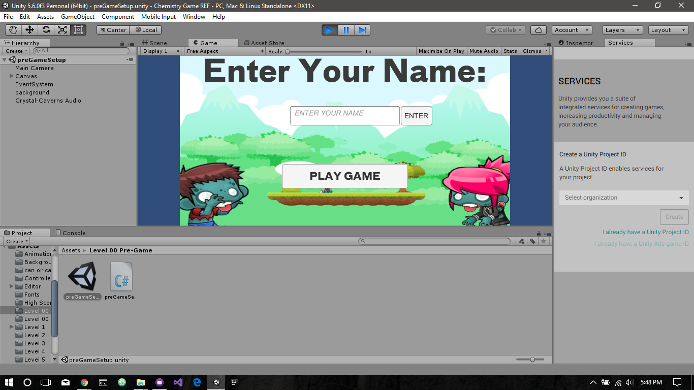
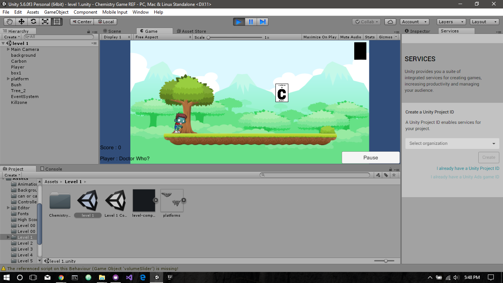
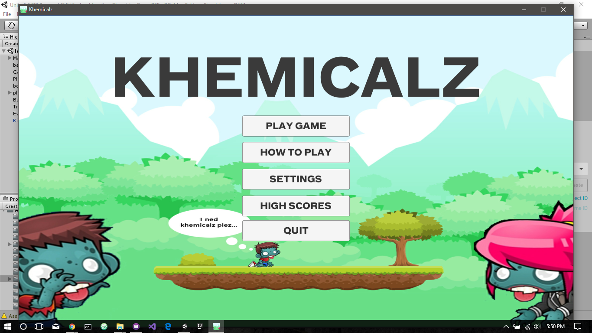
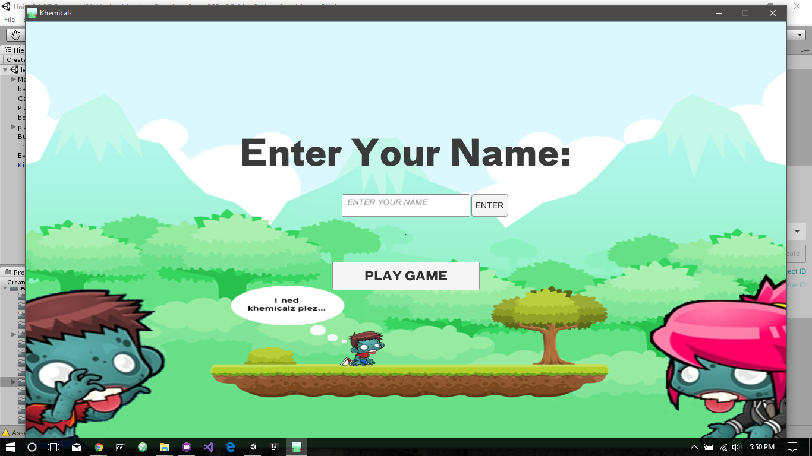
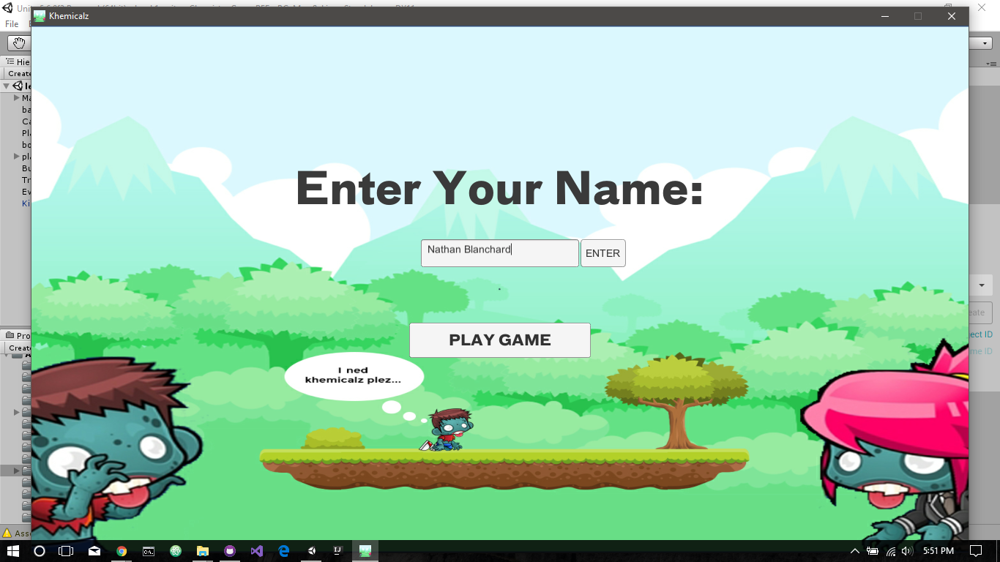
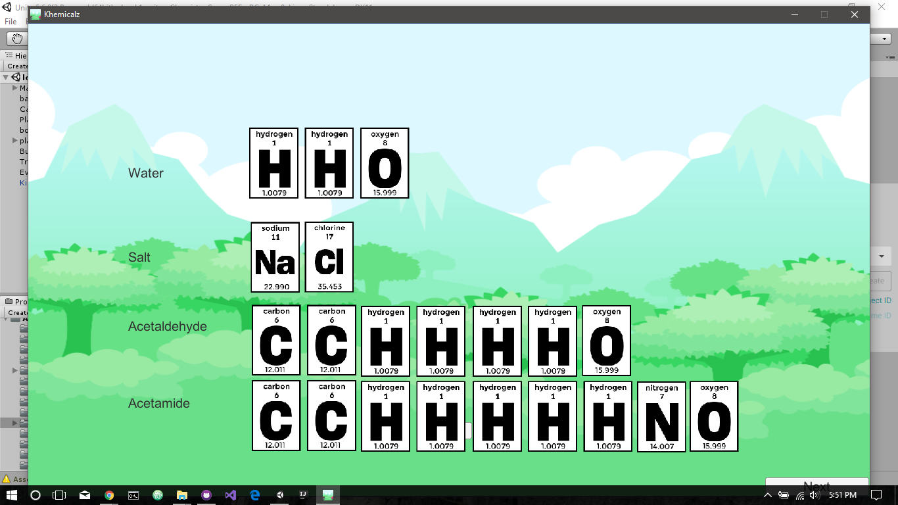
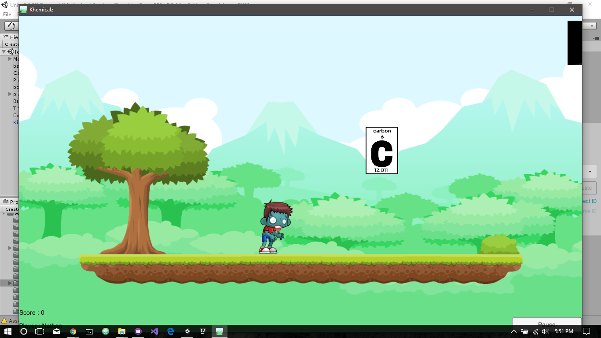
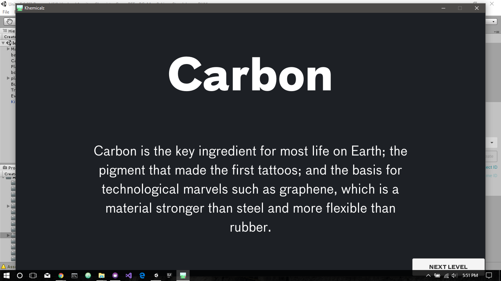
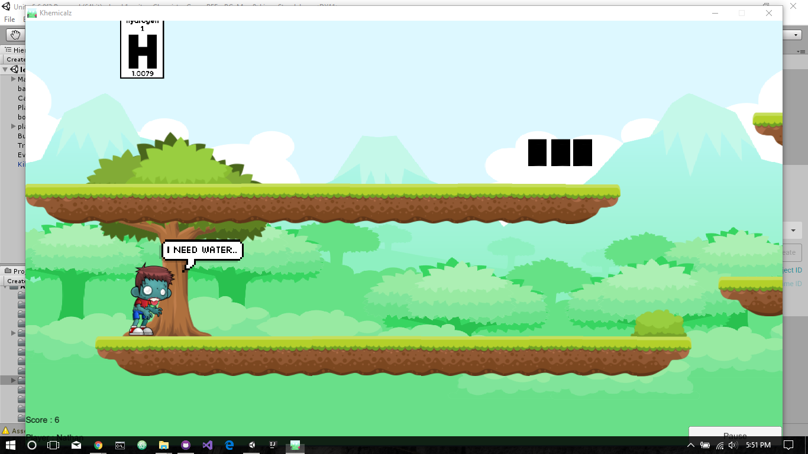
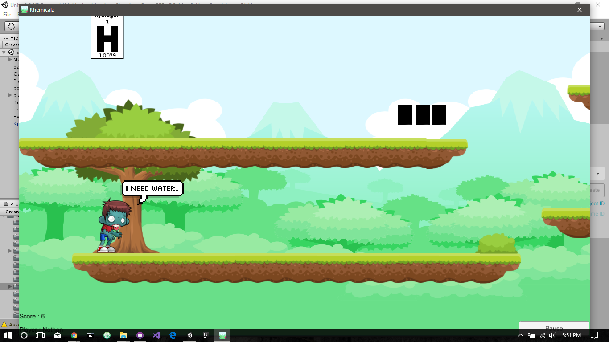

# UnityGameChemistry
A unity game written in C#. A 2D side scrolling game meant to teach the gamer about chemistry. 

Built by:
Ernst Blanchard
Raymond Yee
Brandon Ng
Anthony Fang

Tools Used:
C#
JSON Parsing
Physics

# Example Images:

 

  

 
 

 
 

 
 

 
 

 
 

 
 

 
 

 

